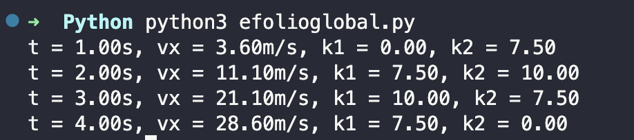

<h1 align="center">
    
</h1>

Efolio Global 2022 - Integração de Heun

📌 Integração de Heun

Um barco de 80,0 kg segue a velocidade constante de
7,00 nós (1 nó = 1,852 km/h) segundo o eixo dos yy quando, no
instante t = 0, entra numa zona de correntes segundo x que lhe
imprimem uma força de componente 𝐹 = 200 ⋅ (4𝑡 − 𝑡$), 𝑡 ∈ [0,4] (SI). #
Calcule a velocidade e rapidez do barco quando sai da zona com corrente horizontal.

Para resolver esse problema, precisamos aplicar a segunda lei de Newton:

F = m*a

onde F é a força resultante sobre o barco, m é a massa do barco e a é a aceleração do barco.

No caso desse problema, temos duas componentes de força atuando sobre o barco: a força da corrente horizontal 𝐹 _x= 200 ⋅ (4𝑡 − 𝑡^2), e a força de arrasto devido à água, que é proporcional à velocidade do barco e é dada por:
------------------
Aplicando o método de Huen para integrar numericamente a equação do movimento de um barco sujeito a uma força de arrasto variável com o tempo.
Criamos listas para armazenar os valores de tempo, velocidade, k1 e k2, que são usados no método de Huen para calcular a solução numérica da equação do movimento.

O método de Huen é então usado para calcular a velocidade do barco em intervalos de tempo sucessivos. O programa itera através de cada intervalo de tempo e, para cada intervalo, calcula o valor de k1 e k2 usando a força de arrasto correspondente no tempo atual e no tempo seguinte, respectivamente. Esses valores são então usados para calcular a velocidade no próximo intervalo de tempo.

Os resultados mostrão cada intervalo de tempo, a velocidade, k1 e k2 para cada passo de integração.

Para compilar colocamos na mesma pasta o ficheiro heun.py e no terminal escrevemos: 
 
<strong>python3 efolioglobal.py</strong> 
 

🔧 Tecnologias utilizadas:
------------------

- <strong>Python 3.8.2</strong>
- <strong>Visual Studio Code</strong>
- <strong>MacOS</strong>

💬 Fale comigo
------------------
[*Entre em contato comigo*](https://www.linkedin.com/in/ivo-baptista-3712144/)

